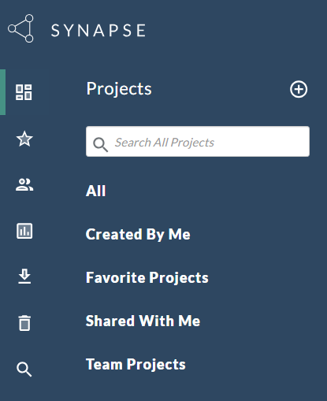

# Overview

[Watch this video for an overview of the data sharing process](https://www.canva.com/design/DAFtre0aRZQ/VP-3prBX72sR7xpqYc8clg/watch)

1. **Create a Synapse Account**: Synapse is the platform used to store and download data. Start by creating a Synapse account [here](https://www.synapse.org/#!RegisterAccount:0). You will also need to complete a [certification quiz](https://www.synapse.org/#!Quiz:Certification) if you plan to upload data. 

2. **Send Sage your username**: If you are part of a research team related to the Gray Foundation, the Data Coordination Center (aka: Sage) will create a team for you (if it hasn't already been created) and add you to the team. Submit your user name [here](https://sagebionetworks.jira.com/servicedesk/customer/portal/17/group/24/create/159).

3. **Navigate to Your Projects**: Once you have an account, you can access your projects. These projects are categorized into three types:
   - `Created By Me`: Projects created by you.
   - `Favorite Projects`: Projects you've marked as favorites.
   - `Shared With Me`: Projects you have access to. 
   - `Team Projects`: Projects associated with your research team.

  

